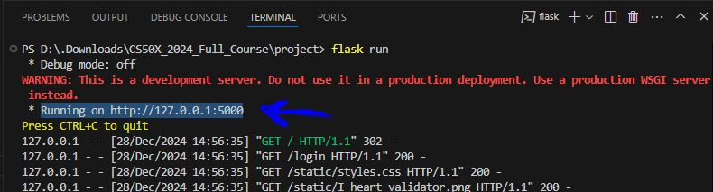
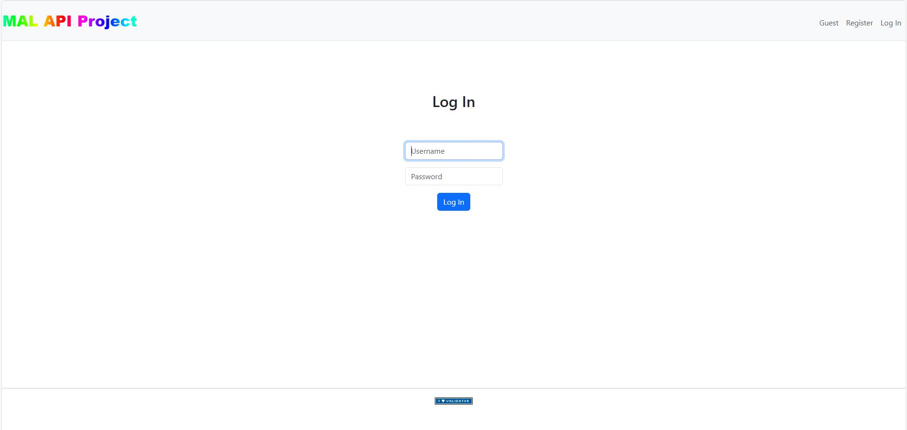
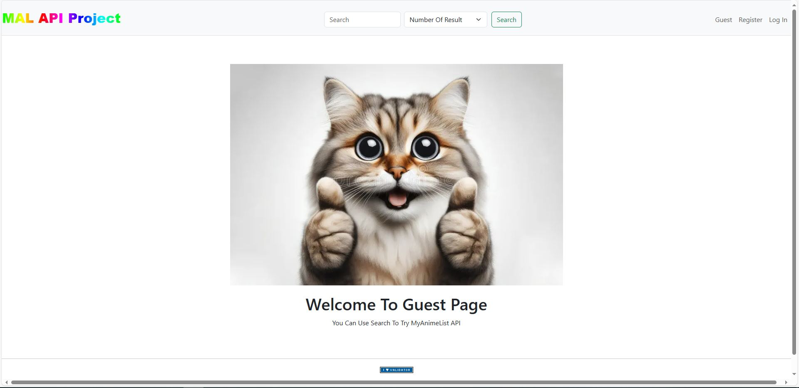
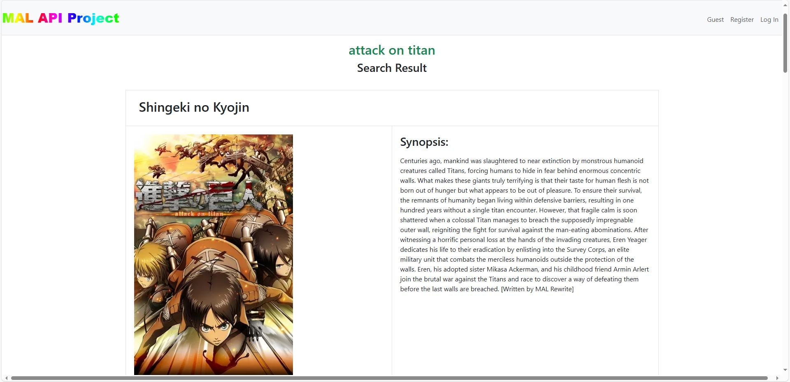
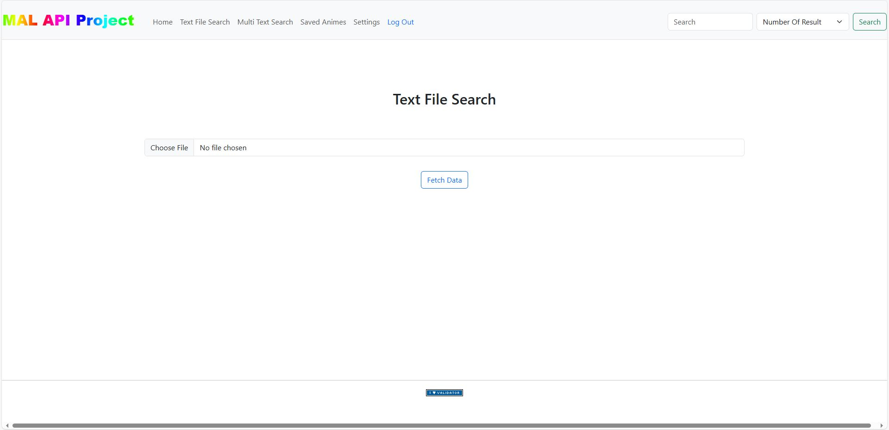
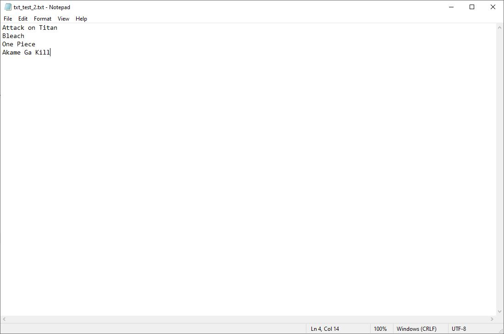
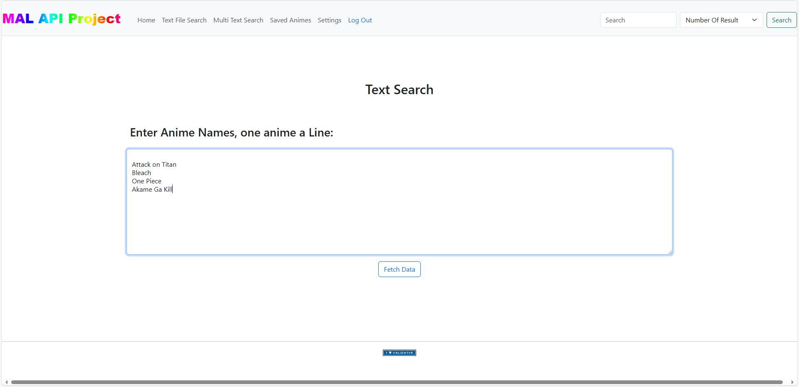
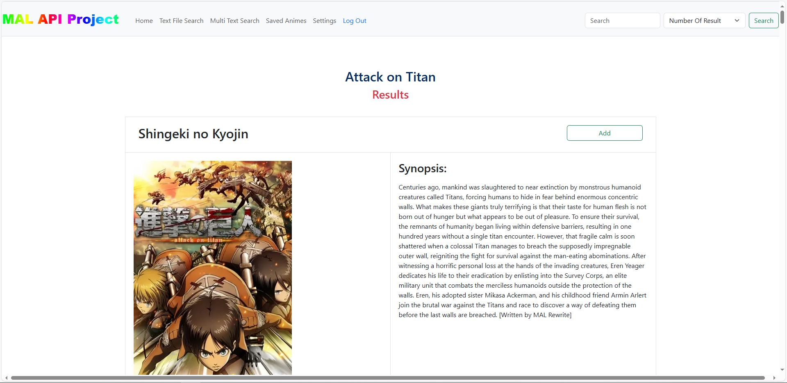
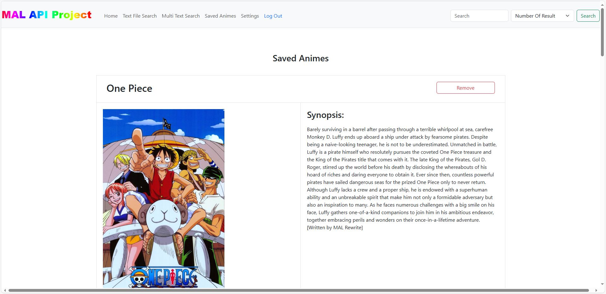
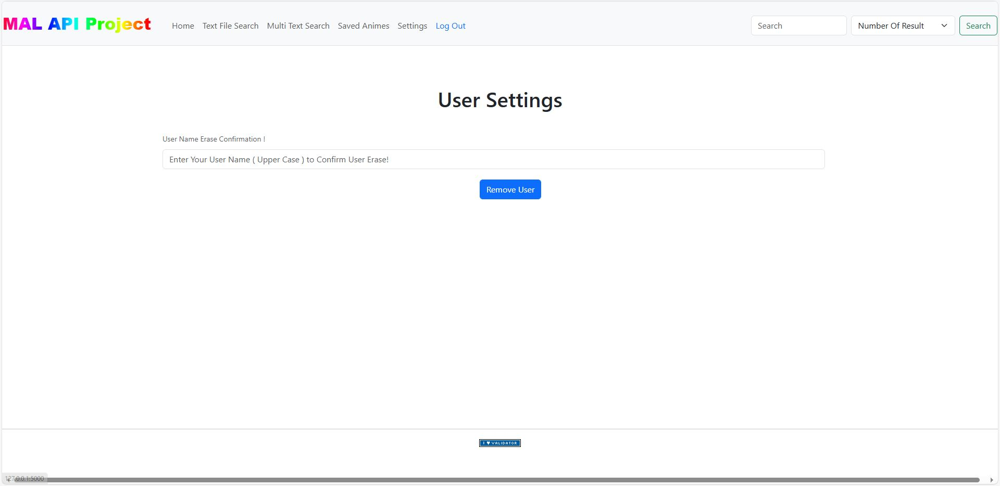

# _MAL API Project_

## Video Demo: [Watch Here](https://youtu.be/MH-EPgqFNe4)

## Description

This is a Web application project made with flask and use MyAnimeList API to Fetch Data from.

**The Idea of The Project**: was to give user Multi Search choices like using a **(.txt)** for search or using a Multiline Text area, for searching multi Anime name at Once.

and give users **Add** Feature to save they favorite Anime in a database file and **Remove** Feature if they want to remove the Anime from the Database file.

and with **View Page** users can view all saved Anime in the database file.

also with **Settings Page** users can **_DELETE_** the Account and all its **DATA**.

## Installing Dependencies

1. **Clone** this repository to your Device:

   ```bash
   git clone https://github.com/AhmedMansour024/MAL-API-Project
   ```

2. Run **make** in the Terminal To Create an Environment:
    - if You Have **Make** Installed.

        ```bash
        make
        ```

- **Or** Create an Environment Manually [Here](https://github.com/AhmedMansour024/Create-Environment-and-Insatalling-Make/blob/36926bbaf26c1b7c0060df2228f4cdad95667c86/INSTALL_VENV.md) and Install all Necessary libraries By using:

    ```bash
    pip install -r requirements.txt
    ```

## How to Use The Program ?

- Run `flask run` In the Terminal to start the Web application.
- open the Local URL.
- Here is An Image

    

- This is the Default Page

    

## **Program Features**

### **_As a Guest_**

By Using the **Guest** Page you can use single search with number of result up to 10 result.



Here is A Search Result For **Attack On Titan**



### **_With An Account_**

you can use **Register** page to make an Acoount, and Log in.

After Logging in you can use **Single Search**, **Text File Search**, **Multi Line Search**.


**Single Search** just like Guest Search.

**File Search**: you can use Text file containing One anime in a row.



and here is An Example of **Text file**:



**Multi Text Search**: its a multi line text area that you can use for searching multi Anime at Once.



### **Search Result Page**

after searching with **File** or **Multi Text Area** the Results will be **Displayed** in a page that contain **5** results for every **Anime** with the search name as a **Header**.



### Saved Animes Page

With the **Add** Button you can save Anime into a database file and View them in the **Saved Animes Page**



Also in the **Saved Animes Page** you can **Remove** any anime you want using **Remove Button**.

### _Settings_ Page

in setting page you can **DELETE** your Account and All its Data.


